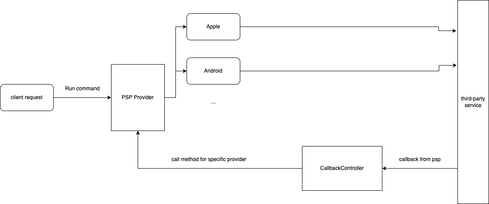

#PSP provider service

###Setup
Requirements:
- docker
- postgres

To run application:
- copy `env.example` to `.env` and set environment variables
- run docker service `docker-copmose up`and application will be available on `127.0.0.1`

###Description
The service is build using [Symfony framework](https://symfony.com/)

API [postman collection](https://documenter.getpostman.com/view/4835088/UVkmPbgB) is used for documenting

The schema of working application:

